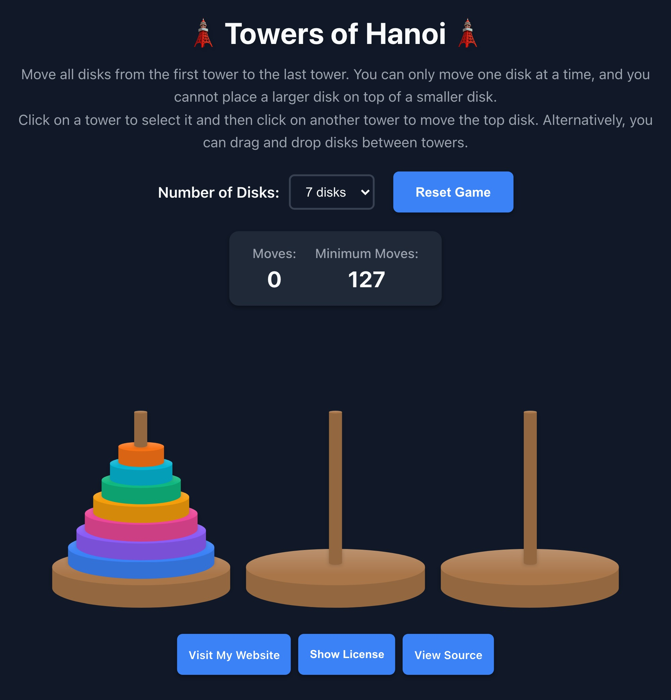
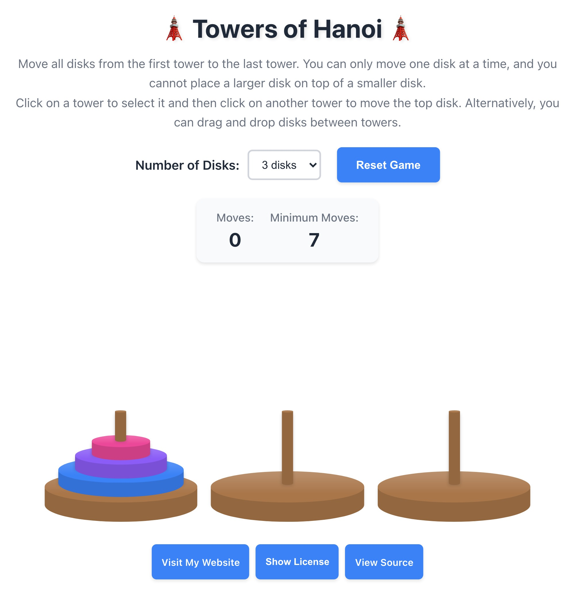

# Towers of Hanoi - React + TypeScript + Bun

Implementation of the classic Towers of Hanoi puzzle game built with React, TypeScript, and Bun.


- [Towers of Hanoi - React + TypeScript + Bun](#towers-of-hanoi---react--typescript--bun)
  - [Screenshots](#screenshots)
  - [About the Game](#about-the-game)
    - [Minimum Moves Formula](#minimum-moves-formula)
  - [Local Development](#local-development)
    - [Available Scripts](#available-scripts)
  - [License](#license)
  - [AWS Deployment](#aws-deployment)

## Screenshots

| Dark Mode | Light Mode |
| --- | --- |
|  |  |

## About the Game

Towers of Hanoi is a classic mathematical puzzle where the objective is to move all disks from the first tower to the last tower, following these rules:

1. Only one disk can be moved at a time
2. A disk can only be placed on top of a larger disk
3. All disks must end up on the third tower

### Minimum Moves Formula

The minimum number of moves to solve the puzzle is: **2^n - 1** (where n is the number of disks):

- 3 disks: 7 moves
- 4 disks: 15 moves
- 5 disks: 31 moves
- 6 disks: 63 moves
- 7 disks: 127 moves
- 8 disks: 255 moves

## Local Development

### Available Scripts

```bash
cd frontend
bun run dev      # Start development server
bun run build    # Build for production
bun run preview  # Preview production build
bun run lint     # Run ESLint
```

## License

This project is licensed under [AGPLv3](LICENSE). The full license text is also viewable in-app via the "Show License" footer link.

## AWS Deployment

This project is deployed to AWS as a static website using OpenTofu/Terraform and my own [static-website-s3-cloudfront-acm](https://registry.terraform.io/modules/joshuamkite/static-website-s3-cloudfront-acm/aws) Terraform module, wired up to detect source file changes, rebuild the React app, sync new files to S3, and invalidate CloudFront cache
